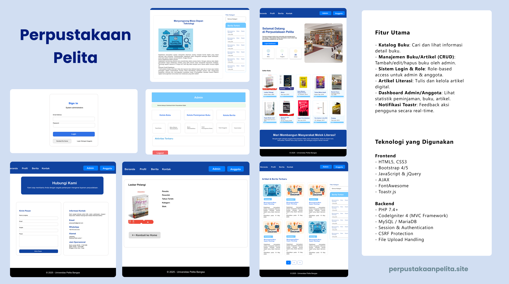

# 🏛️ Perpustakaan Pelita - Sistem Informasi Perpustakaan Digital

**Aplikasi Perpustakaan Berbasis Web**  
*Proyek Ujian Akhir Semester Pemrograman Web 2 - Universitas Pelita Bangsa*

## 👥 Tim Pengembang
| NIM | Nama | Role | Kontribusi |
|------|----------------|-------------------------------|----------------------------|
| 312310120 | Dini Ramadani | Fullstack Developer | CodeIgniter4, Database, JQuery, Bootstrap |
| 312310090 | Dian Fitriani | QA & Dokumentasi | Testing, Laporan |
| 312310635 | Jakaria Firmansyah | Frontend Developer | UI/UX, Bootstrap |

**Dosen Pengampu:**  
Agung Nugroho, S.Kom., M.Kom.

## 🛠️ Teknologi
### Frontend

### Backend

## 🌟 Fitur Utama
### 🧑‍💻 Untuk Pengunjung
- 🔍 Pencarian buku dengan multi-filter
- 📚 Preview koleksi buku terbaru
- 📰 Baca artikel literasi
- 🏢 Informasi perpustakaan

### 👨‍🎓 Untuk Anggota
- ⏳ Riwayat
- 📊 Dashboard pribadi

### 👨‍💼 Untuk Admin
- 📖 Manajemen katalog buku (CRUD)
- 👥 Kelola data anggota
- 📈 Statistik real-time
- ✍️ Publikasi artikel
- 📁 Laporan periodik
